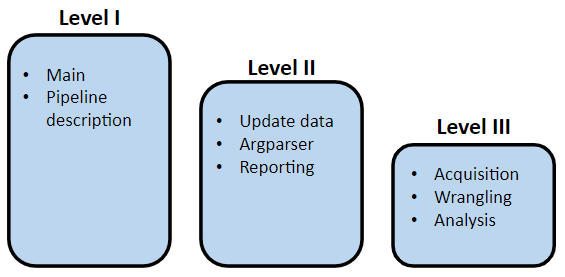

# BiciMAD/biciPARK stations closest to public schools
 Welcome to this project designed to obtain the distance from the  biciMAD or biciPARK stations to each of the public schools in Madrid.
 

### 🎯 The project description
The main goal is to obtain a table with information about the distance between public schools and the nearest biciMAD/biciPARK station. The user can decide if he wants to see the results for all schools or for one of them specifically. To calculate the distance between two points, it is required to use the geopandas function.
- BiciMAD is the public electric bicycle rental system of the city of Madrid managed by the EMT of Madrid. 
- BiciPARK is a place where you can park your own bike.
The city council has available the data of these stations through its website. It is possible to know the free places in the case of bicimad, but not bicipark.


### 📑 Dataset
There are two main sources of information, csv and data from api rest:
- CSV file Bicimad stations (located in data folder)
- CSV file Bicipark stations (located in data folder)
- API REST connection with Portal de datos abiertos del Ayuntamiento de Madrid, with the following dataset /catalogo/202162-0-instalaciones-accesibles-municip.json, from now known as 'Places of interest'
- API REST connection with BiciMAD EMT web.


### 🚀 Pipeline
In the 'main_script' file you can see at a high level how the pipeline works. In addition, the different options that are made depending on the options chosen by the user using argparser are included.
<p align="center">
 
</p>
  
From the 'main_script' the functions found in the modules argparser, update_data and reporting are used. From these three modules, the functions stored in acquisition, wranling and analysis are used.
It should be noted that in each of the modules, the functions included in each of them are organized as auxiliary functions and pipeline functions. The latter are the functions used during the pipeline or in other modules. While the auxiliary functions are functions used in that same module.

Usage
At the execution of pipeline with main_script.py, the user must input through 'argparse' different configuration options:
- Option 1: import raw or already calculated data. Since the geopandas function is a bit slow and both schools and biciMAD stations are datasets that do not change frequently, all the calculated data are stored so as not to have to perform the calculations each time the information is consulted. 
- Option 2: choose between showing the nearest biciMAD or bicipark station.
- Option 3: display the complete table or for a single public school.
In this sniped the code you can see an example (you can see more information in the module 'argparser'):
```
python main_script.py -p 'import' -s 'bicimad' -r __school_name__
```
The data stored in the 'processed' folder are the bicimad/bicipark datasets already extracted and cleaned. On the other hand, as mentioned above, the complete dataframe with all calculated distances is saved.
The requested result will be displayed on the screen and in case you want to view the entire table it will be saved in a csv file in the folder: data -> result.

### 💻 Technology stack

- Python==3.9.18
- pandas==2.1.1
- numpy==1.26.0
- argparse==1.4.0
- requests==2.31.0
- dotenv==1.0.0
- fuzzywuzzy==0.18.0
- geopandas==0.14.1
- shapely==2.0.2


### 📁 Folder structure

    ├── project
    ├── .gitignore
    ├── README.md
    ├── main_script.py
    ├── LICENSE
    ├── img
    ├── modules
    |   ├── argparser.py
    |   ├── update_data.py
    |   ├── acquisition.py
    |   ├── wrangling.py
    |   ├── analysis.py
    |   └── reporting.py
    ├── notebooks
    |   └── test_function.py
    └── data
        ├── raw
        |   ├── bicimad_stations.csv
        |   └── bicipark_stations.csv
        ├── processed
        |   ├── bicimad.csv
        |   ├── bicipark.csv
        |   └── distance_calculated.csv
        └── result
             └── result.csv

### 👀Context
This is the final project of module 1 for the Ironhack Part Time Data Analytics Bootcamp. The requirements can be found in the readme of the following repository:
https://github.com/ih-datapt-mad/ih_datamadpt0923_project_m1

### 📨 Contact info

If you have some question, drop me a line! (sanchezvicentecarlos@gmail.com).